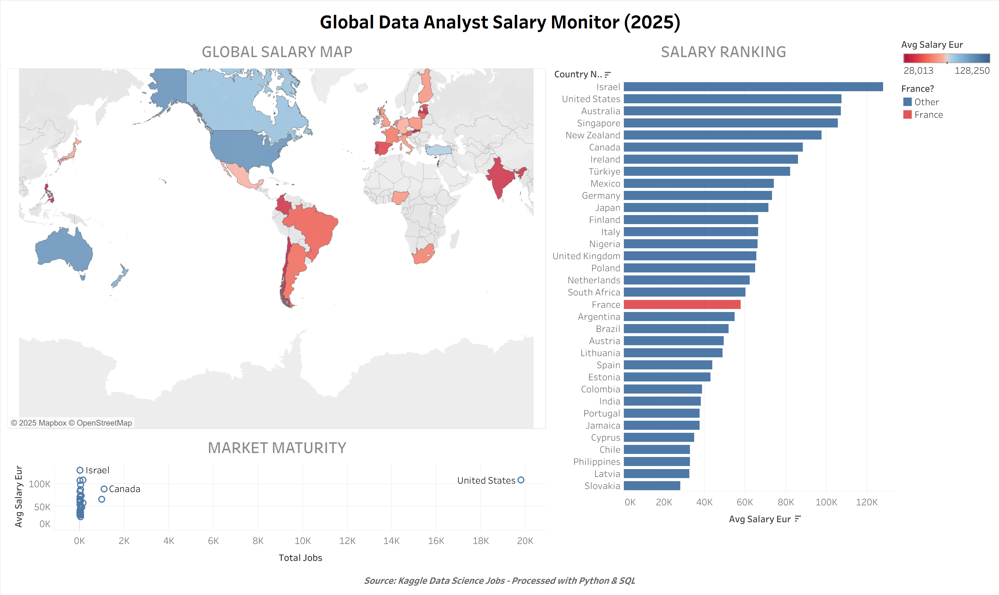

# Global-Data-Analyst-Salary-Monitor
How much do Data Analysts earn globally? A full-stack data project using Python (Pandas) for geocoding, SQL for analysis, and Tableau for mapping.
# Version Française en-dessous !!

# Global Data Analyst Salary Monitor (2020-2025)
> **Transparency Note:**
> This project was architected and solved manually. I leveraged AI tools (LLMs) strictly as productivity assistants for **code commenting**, **debugging**, and **documentation formatting**. The analytical logic and financial modeling are entirely my own.

### Why this project?
As I am transitioning into a Data Analyst role in France, I was curious about the global market.
I wanted to answer simple but critical questions:
* Where are the best salaries for Data Analysts?
* How does the **French market** compare to the US or Switzerland?
* Is the market mature everywhere?

Instead of just looking at Excel sheets, I decided to build a **full data pipeline** to visualize the answers on a map.

### The Dashboard
*(Click the link below to interact with the map)*

 **[View the Interactive Dashboard on Tableau Public](https://public.tableau.com/views/GlobalDataMonitor/Dashboard1?:language=en-US&:sid=&:redirect=auth&:display_count=n&:origin=viz_share_link)**

---

### The Tech Stack (My "Hybrid" Approach)
I used a combination of tools to handle specific challenges:

* **Python (Pandas & Pycountry):**
    * *The Challenge:* The raw data only had 2-letter country codes (e.g., "FR", "DE"), but Tableau needs full country names for mapping.
    * *The Solution:* I wrote a Python script to map ISO codes to real names using the `pycountry` library.
* **SQL (PostgreSQL):**
    * *The Challenge:* The dataset contained thousands of rows with mixed currencies.
    * *The Solution:* I used SQL to filter only "Data Analyst" roles and standardize all salaries into **Euros (€)** for a fair comparison.
* **Tableau Public:**
    * Used for the final storytelling: Geographic Heatmap and Market Maturity Matrix.

---

### How I built it (Step-by-Step)

#### 1. Data Extraction & Cleaning (SQL)
I started with a global dataset of data jobs. I wrote a SQL query to:
* Filter specifically for **Data Analyst** roles (ignoring Scientists/Engineers for this specific study).
* Convert salaries from USD to EUR (using a standard exchange rate).
* *See file: `1_Création_et_nettoyage_data_analyst.sql`*

#### 2. Geographic Enrichment (Python)
I exported the raw SQL data and processed it with Python to add geolocation data.
* Mapped `US` → `United States`, `FR` → `France`, etc.
* Handled missing values to ensure clean mapping in Tableau.
* *See file: `3_Global_data_jobs_enriched.ipynb`*

#### 3. Final Aggregation (SQL)
I re-imported the enriched data into the database to calculate the final KPIs:
* Average Salary per country.
* Salary Volatility (Standard Deviation) to understand risk.
* *See file: `5_Script_table_finale_avec_KPIs.sql`*

---

### Key Insights
1.  **The US Gap:** The United States remains the outlier with the highest salaries and the highest volume of offers.
2.  **France Position:** France offers a stable market but with lower average compensation compared to Switzerland or the US.

---

# 🇫🇷 Version Française
> **Note de transparence :**
> Ce projet a été conçu et codé manuellement. L'IA a été utilisée uniquement comme outil de productivité pour le **formatage**, les **commentaires de code** et le **débogage**, simulant un flux de travail professionnel moderne. La logique analytique et financière est entièrement personnelle.

### Pourquoi ce projet ?
En pleine transition vers le métier de Data Analyst en France, je me posais des questions concrètes sur le marché mondial :
* Où sont les meilleurs salaires pour un Data Analyst ?
* Comment se situe le **marché français** face aux géants comme les USA ou la Suisse ?
* Le marché est-il mature partout ?

Plutôt que de regarder de simples fichiers Excel, j'ai décidé de construire un **pipeline de données complet** (SQL + Python) pour visualiser les réponses sur une carte interactive.

### Le Dashboard
*(Cliquez sur le lien ci-dessous pour manipuler la carte)*

 **[Voir le Dashboard Interactif sur Tableau Public](https://public.tableau.com/views/GlobalDataMonitor/Dashboard1?:language=en-US&:sid=&:redirect=auth&:display_count=n&:origin=viz_share_link)**

---

### La Stack Technique (Approche Hybride)
J'ai utilisé une combinaison d'outils pour répondre à des défis précis :

* **Python (Pandas & Pycountry) :**
    * *Le Défi :* Les données brutes ne contenaient que des codes pays à 2 lettres (ex: "FR", "DE"), illisibles pour une carte grand public.
    * *La Solution :* J'ai écrit un script Python pour "traduire" ces codes ISO en noms de pays complets via la librairie `pycountry`.
* **SQL (PostgreSQL) :**
    * *Le Défi :* Un dataset de plusieurs milliers de lignes avec des devises mélangées.
    * *La Solution :* J'ai utilisé SQL pour isoler uniquement le métier de "Data Analyst" et standardiser tous les salaires en **Euros (€)** pour une comparaison équitable.
* **Tableau Public :**
    * Utilisé pour la narration finale : Carte de chaleur (Heatmap) et Matrice de maturité du marché.

---

### Ma Méthode (Étape par étape)

#### 1. Extraction et Nettoyage (SQL)
J'ai commencé par requêter la base de données mondiale pour :
* Filtrer spécifiquement les rôles de **Data Analyst** (en excluant les Scientists/Engineers pour cette étude).
* Convertir les salaires USD vers EUR (taux de change standardisé).
* *Voir fichier : `1_Création_et_nettoyage_data_analyst.sql`*

#### 2. Enrichissement Géographique (Python)
J'ai exporté les données SQL brutes et utilisé Python pour ajouter la géolocalisation :
* Mapping `US` → `United States`, `FR` → `France`, etc.
* Gestion des valeurs manquantes pour assurer une carte propre.
* *Voir fichier : `3_Global_data_jobs_enriched.ipynb`*

#### 3. Calculs Finaux (SQL)
J'ai réimporté les données enrichies dans la base pour calculer les KPIs finaux :
* Salaire moyen par pays.
* Volatilité des salaires (Écart-type) pour comprendre le risque/la disparité.
* *Voir fichier : `5_Script_table_finale_avec_KPIs.sql`*

---

### Ce que les données révèlent
1.  **Le fossé américain :** Les États-Unis restent l'exception mondiale avec les salaires les plus élevés et le plus fort volume d'offres.
2.  **La position de la France :** La France offre un marché stable, mais avec une rémunération moyenne inférieure à ses voisins comme la Suisse ou l'Allemagne.

